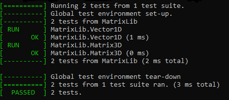

<!-- e948dab61d9a411dfe273eb6da65f723 -->

# MatrixFlatten
A library that implements a 3D matrix, the 3D matrix is 
 stored in the memory in a flatten manner.

## Project Information
- **Language:** C++
- **Build System:** CMake
- **Package Management:** using GIT submodules
- **Testing Framework:** [GoogleTest](https://github.com/google/googletest) \
**Note:** you have to use **git clone --recursive** in order to pull the dependencies

## Project Structure
- **MatrixLib:** The library implements the 1D vector (Vector1D) and the 3D matrix (Matrix3D) data structures
- **MatrixLibTestsTest:** The unit tests for MatrixLib library.

## Tests

